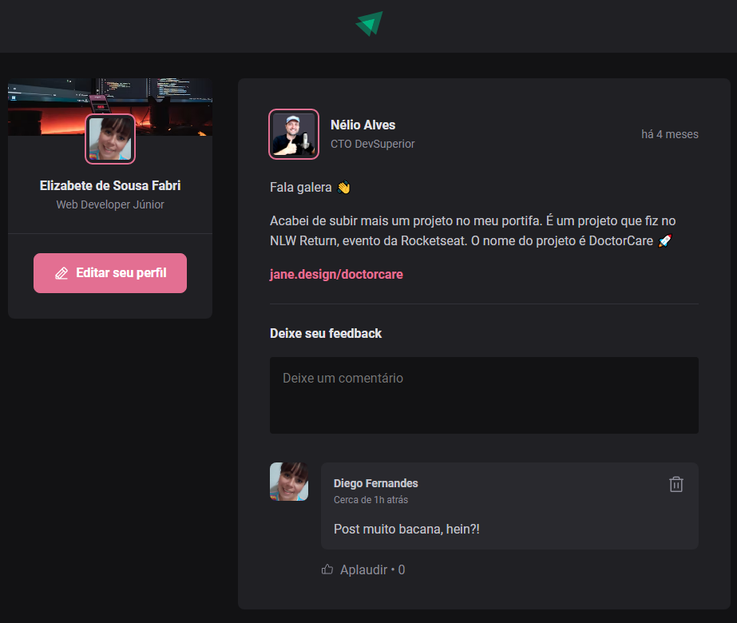
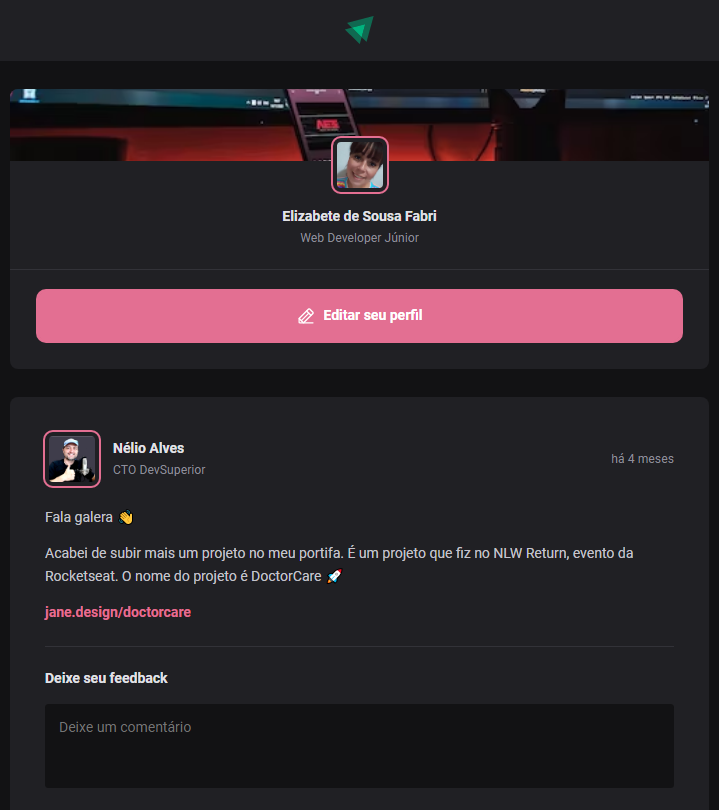

# Imagens do projeto Finalizado
<a href="#">
  <br><br>
  
</a>

## Ferramentas utilizadas no projeto

- Nodejs 16 e Yarn
- Phosphor icons (https://phosphoricons.com/)
- VS Code
  - `ViteJs`
  - `TypeScript`

## Comandos para criar o projeto

```
yarn create vite frontend --template react-ts
```

## Adicionar o projeto inicial no Git
```bash
git init

git add .

git commit -m "Project created"

git branch -M main

git remote add origin git@github.com:seuusuario/seurepositorio.git

git push -u origin main
```


